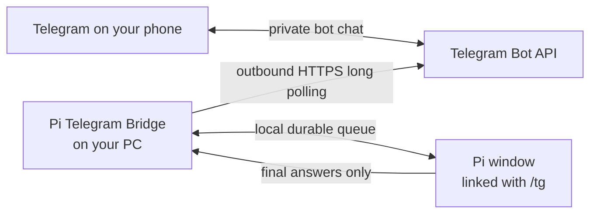

# Pi Telegram Bridge — control Pi from your phone

Talk to a Pi coding session on your Windows PC from your own private Telegram bot: send a normal message from your phone and receive Pi's finalized answer in the same chat.

You control only Pi sessions that you explicitly link with `/tg`. This is **not** remote CMD, PowerShell, or shell access to your PC.

**Never used anything like this before? Read this file from top to bottom and follow the steps in order. It takes about 10 minutes, and every step tells you what to type and what you should see.**

## What this is, in plain words

- **Pi** is an AI coding agent that runs in a terminal window on your PC. You type what you want, and Pi writes and changes code in your project folder.
- **This bridge** is a small relay that lives on your own PC. It connects your private Telegram bot chat to Pi. Nothing is hosted anywhere else — if your PC is off or asleep, the bridge is off too.
- **What reaches your phone** is only Pi's finalized answers — never your files, never your shell, never Pi's hidden reasoning. Your phone talks *to Pi*; it does not touch the rest of your PC.
- **What it is NOT:** it is not a way to run commands on your PC from your phone. There is no remote CMD or PowerShell access, and there is no listening port on your PC.

## Check your PC first (2 minutes)

Open this table and check each row before you start. Each check takes seconds, and finding a problem now saves you a failed setup later.

| What you need | How to check it | Where to get it |
|---|---|---|
| Windows 11 with PowerShell 5.1 or later | You are most likely fine. Windows 11 includes PowerShell 5.1 already. | Already included in Windows 11. |
| Node.js **24 or newer** | Press the Windows key, type `cmd`, press Enter to open the Command Prompt, type `node --version` and press Enter. | [https://nodejs.org](https://nodejs.org) — download the LTS installer and run it. |
| Pi installed and working on this same PC | Open Pi in a terminal and use it normally at least once. | Your existing Pi installation. |
| Telegram signed in on your phone | Open Telegram on your phone and confirm you are signed in. | [https://telegram.org](https://telegram.org) or your phone's app store. |

One more requirement that you cannot download: **your PC has to stay awake and online while you use the bridge.** Nothing runs in the cloud. If the PC sleeps or goes offline, the bot cannot answer until the PC is available again.

The Node.js check is the one that usually fails. Two things you might see after typing `node --version`:

- **`'node' is not recognized`** — Node.js is not installed (or Windows cannot find it yet). Install the current Node.js from [https://nodejs.org](https://nodejs.org), then **close the Command Prompt and open a new one** so Windows finds the freshly installed program, and try `node --version` again.
- **A version starting with `v18.` or `v22.`** — Node.js is installed but too old for this bridge. Install the current version from [https://nodejs.org](https://nodejs.org) and check again.

One reassurance: the setup on this PC now **refuses an unsupported Node.js before it asks you for anything** — before your bot token, before your phone, before it changes any setting. So if your Node.js is old, you will find out immediately in plain words, and nothing on your PC will have been touched. Checking first still saves you the wasted attempt.

## Step 1 — get the files onto your PC

You need the **whole folder** of this project on your PC — not just this README file. The setup uses several files in the folder together.

Pick one of these two routes:

- **You received a ZIP file.** Right-click the ZIP file and choose **Extract All...**. Choose a simple, short location such as `C:\pi-telegram-bridge`, and finish the extraction. Do not run the tool from inside the ZIP window — always from the extracted folder.
- **You use git.** Run `git clone <repository-url>` in a terminal. <!-- TODO: replace <repository-url> once the repository is published -->

Two places to avoid:

- **Do not** put the folder inside OneDrive or any other synced folder (for example `C:\Users\you\OneDrive\...`). Sync software can interfere with the bridge's local files.
- **Do not** put the folder inside `C:\Program Files` or `C:\Program Files (x86)`. Windows protects those folders in ways that get in the setup's way.

A simple path like `C:\pi-telegram-bridge` works well.

## Step 2 — create your Telegram bot

You will create your own private bot in Telegram. This takes about 2 minutes.

1. Open Telegram on your phone and search for the official, verified **@BotFather** account (it has a verified checkmark).
2. Send it the message `/newbot`. It asks two questions: choose a display name, then choose a username that ends in `bot`.
3. BotFather replies with a **token** — a long line of letters, numbers, and colons. Copy it somewhere private on your PC. **Treat it like a password:** anyone who has it can use your bot. Never put it in issues, chats, logs, or screenshots.
4. Recommended: in BotFather, open your bot's settings and turn **Allow Groups** off. This keeps your bot private to you.

## Step 3 — run the setup

1. Open the folder you extracted in Step 1 (for example `C:\pi-telegram-bridge`).
2. Double-click **`Setup Pi Telegram.cmd`**. A black window opens — this is normal.
3. The window prepares a few local files. If a small helper package is missing, it downloads one small package from the internet. This usually takes a minute or two.
4. When it asks, **paste the bot token from Step 2**. The window hides what you paste. The token stays on your PC: it is stored in encrypted form (protected for your Windows account) and is never typed, sent, or shown anywhere else — not on your phone, not in any chat, not in any log.
5. The window shows a **QR code**. Open the camera app on your phone and point it at the code. Telegram opens your bot; tap **Start**. The code contains only the bot's name and a one-use pairing code — never the token.
6. The window waits up to a minute for your phone. When your phone is recognized, it asks you to type **ENROLL** to confirm. Nothing is saved until you do.
7. After you confirm, the window installs a small helper inside Pi (it stays inactive until *you* link a Pi window in Step 4), sets up a background connection that starts automatically each time you sign in to Windows, and starts it.

If anything fails along the way, your previous settings are kept safe and nothing half-finished is saved. See [Fix problems](#fix-problems).

## Step 4 — link Pi and talk

The bridge is installed, but every Pi window stays **disconnected until you link it** — this is deliberate.

1. Open Pi in a terminal on your PC. If Pi was already open during setup, type `/reload` once so it discovers the new helper.
2. Type `/tg` and choose **Connect** in the confirmation that appears.
3. Send a normal text message to your bot from your phone.

Pi's finalized answer arrives in the same chat.

## How do I know it worked?

Four things to look for, in order:

1. The setup window ended with the words **`Setup complete.`**
2. After you typed `/tg` and chose Connect, Pi replied with a message starting **"Linked. Send a message from your phone..."**
3. A normal message you typed on your phone reached that Pi as a prompt.
4. Pi's finalized answer came back to the same Telegram chat.

Any three of the four means you are almost there — check [Fix problems](#fix-problems) for the missing one.

## Everyday use

| On your phone | What happens |
|---|---|
| Send normal text | It becomes a prompt for the selected linked Pi. |
| Tap **Status** | The bot reports the selected Pi's connection state and model. |
| Tap **Change Pi** | Choose another linked Pi by its readable project label. |
| Tap **Disconnect** | Disconnect the selected Pi from Telegram. |
| Send text while Pi is busy | Choose whether to add it for later, redirect the current task, stop and use it, or leave the task alone. |

On the PC:

- `/tg` opens the connection controls for that Pi window.
- `/tg off` disconnects that Pi window.
- Every new Pi window starts disconnected. Link only the windows you want available from your phone.
- Pi windows that were already running may need `/reload` once after an install or upgrade.

## Fix problems

Find your symptom, then follow the matching action. A failed setup never replaces an existing working link.

| Symptom | What to do |
|---|---|
| Setup says it needs a newer Node.js | You are on Node.js 18 or 22. Install the current Node.js from [https://nodejs.org](https://nodejs.org), close the setup window, and run `Setup Pi Telegram.cmd` again. Nothing was changed on your PC. |
| `'node' is not recognized` when you check the version | Node.js is not installed. Install it from [https://nodejs.org](https://nodejs.org), then close and reopen the Command Prompt so the new PATH is picked up. |
| You double-clicked the setup file from **inside the ZIP file** | Windows runs it from a temporary folder that has none of the other project files, and the setup can report a missing tool that you actually have. Close that window, extract the ZIP properly (right-click → **Extract All...**), then run `Setup Pi Telegram.cmd` from the extracted folder. |
| Your setup folder is inside OneDrive or `Program Files` | Move the extracted folder somewhere simple such as `C:\pi-telegram-bridge` and run setup again. |
| Setup could not prepare its local files | Check your internet connection, then run `Setup Pi Telegram.cmd` again. Advanced details are in `.local/logs/setup-dependencies.log`. |
| Setup says the token did not work | Get the current token from BotFather using `/token` or `/mybots`, then copy and paste it again. |
| The QR code expired or will not scan | Close setup and run `Setup Pi Telegram.cmd` again for a fresh code. Raise the screen brightness and move the phone closer. |
| The QR link opens a web page | Open Telegram directly, search for your bot username, tap **Start**, then run setup again. |
| `/tg` does not exist in Pi | Type `/reload`, or restart Pi if it was already open during setup. |
| `/tg` says the phone connection is unavailable | Keep the Pi linked and restart Windows so the background connection starts again at sign-in. Then send your message again. |
| The bot says no Pi is connected | Open Pi on the PC, type `/tg`, and choose **Connect**. |
| The bot does not answer | Make sure the PC is awake and online. If needed, restart Windows so the background connection starts at sign-in. |
| Several Pi windows are linked | Tap **Change Pi** and choose the readable project label you want. |
| You want to remove the bridge | Follow [Uninstall and rollback](docs/ADVANCED.md#uninstall-and-rollback). State and backups are preserved unless you remove them yourself. |

For service status, repair, manual setup, and the full command reference, see the [Advanced guide](docs/ADVANCED.md).

## Words you'll see (plain-language glossary)

| Word | What it means here |
|---|---|
| **Bot** | A Telegram account run by a program instead of a person. You create your own with @BotFather, and only you can talk to it. |
| **Token** | The secret password BotFather gives you for your bot. It stays encrypted on your PC and never appears in chats or logs. |
| **`/tg`** | The command you type inside a Pi window to link (or unlink, with `/tg off`) that window to your phone. |
| **Pi window** | One running copy of Pi in a terminal. You can have several; each one is linked separately. |
| **Session / workspace** | A session is one live Pi window the bridge knows about; the workspace is the project folder that window is working in. Its folder name becomes the readable label you see on your phone, like `Pi · my-project`. |
| **The background connection** | A small program that runs quietly on your PC and shuttles messages between Telegram and Pi, so Pi can answer even when that Pi window is doing something else. It starts each time you sign in to Windows (it is registered as a Windows scheduled task, and it talks to Telegram by long polling). |

## Is it safe?

The bridge is local and fail-closed by design:

- Every Telegram message and button press must match both the enrolled private user ID and private chat ID. Messages from anyone else are ignored.
- The PC makes outbound HTTPS long-poll requests to Telegram; the bridge opens no listening port.
- The plaintext bot token never appears in source, process arguments, environment variables, chat, or logs. Its only on-disk form is an encrypted blob (Windows DPAPI, protected for your Windows account) inside a user-only state directory.
- Each Pi process opts in locally with `/tg`.
- Remote input reaches Pi only through Pi's official prompt, steer, follow-up, abort, status, and disconnect APIs. There is no remote shell.
- Telegram receives finalized assistant answers and explicit status results — not hidden reasoning, token-by-token streams, or raw tool-call transcripts.
- The QR code contains no token, user ID, or chat ID.

Read the full threat model and disclosure policy in [SECURITY.md](SECURITY.md).

To revoke access immediately, use BotFather → `/mybots` → your bot → **API Token** → **Revoke current token**. Run setup again to enroll the replacement token.

## Learn more

- [Quickstart in Spanish / Guía rápida en español](QUICKSTART.es.md) — a short Spanish guide from zero to a working install
- [Advanced guide](docs/ADVANCED.md) — commands, service lifecycle, manual setup, rollback, and legacy mode
- [Architecture](docs/ARCHITECTURE.md) — trust boundaries, data flow, durable transport, and component map
- [Beginner UX contract](docs/BEGINNER_UX.md) — exact product behavior used by maintainers

## Contributing, security, and license

Released under the [MIT License](LICENSE).

- Report security issues through [SECURITY.md](SECURITY.md).
- Development setup and contribution rules are in [CONTRIBUTING.md](CONTRIBUTING.md).
