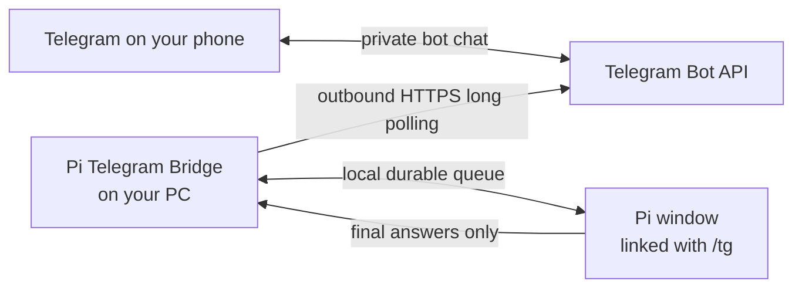

# Pi Telegram Bridge — control Pi from your phone

Talk to a Pi coding session on your Windows PC from your own private Telegram bot. Send a normal message, choose a Pi window when more than one is available, and receive the finalized answer in the same chat.

You control only Pi sessions that you explicitly link with `/tg`. This is **not** remote CMD, PowerShell, or shell access to your PC.

## Requirements

- Windows 11 and Windows PowerShell 5.1 or later
- Node.js 24 or later
- Pi installed and working
- Telegram signed in on your phone
- A PC that stays awake and online while you use the bridge

There is no hosted relay. If your PC sleeps or goes offline, your bot cannot answer until the PC is available again.

## Set it up — three steps

### 1. Create your Telegram bot

1. Open the official, verified **@BotFather** account in Telegram.
2. Send `/newbot`, choose a display name, and choose a username ending in `bot`.
3. Copy the token BotFather gives you. Treat it like a password: never put it in issues, chats, logs, or screenshots.
4. Recommended: open the bot's settings in BotFather and turn **Allow Groups** off.

### 2. Run Setup Pi Telegram

Download and extract this repository, then double-click **`Setup Pi Telegram.cmd`**.

The guided setup:

1. prepares the pinned local dependency used to render the QR code;
2. asks for the bot token with hidden input;
3. displays a local QR code containing only the bot username and a one-use pairing code;
4. waits for you to open the bot on your phone and tap **Start**;
5. asks you to type **ENROLL** before it saves anything;
6. installs the inert Pi extension, registers one current-user logon task named `PiTelegramBridgeBroker`, and starts the background connection.

The token is stored only as a Windows DPAPI-encrypted blob protected for your Windows account. If setup fails, the previous working configuration stays intact.

### 3. Link Pi and start talking

1. Open Pi. If it was already open during setup, type `/reload` once.
2. Type **`/tg`** and choose **Connect**.
3. Send a normal text message to your bot from your phone.

Pi's finalized answer arrives in the same private chat.

## Everyday use

| On your phone | What happens |
|---|---|
| Send normal text | It becomes a prompt for the selected linked Pi. |
| Tap **Status** | The bot reports the selected Pi's connection state and model. |
| Tap **Change Pi** | Choose another linked Pi by its readable project label. |
| Tap **Disconnect** | Disconnect the selected Pi from Telegram. |
| Send text while Pi is busy | Choose whether to add it for later, redirect the current task, stop and use it, or leave the task alone. |

On the PC:

- `/tg` opens the connection controls for that Pi window.
- `/tg off` disconnects that Pi window.
- Every new Pi process starts disconnected. Link only the windows you want available from your phone.
- Running Pi windows may need `/reload` once after an install or upgrade.

## Is it safe?

The bridge is local and fail-closed by design:

- Every Telegram message and button press must match both the enrolled private user ID and private chat ID.
- The PC makes outbound HTTPS long-poll requests to Telegram; the bridge opens no listening port.
- The plaintext bot token never appears in source, process arguments, environment variables, chat, or logs. Its only on-disk form is a DPAPI-encrypted blob inside a user-only state directory.
- Each Pi process opts in locally with `/tg`.
- Remote input reaches Pi only through Pi's official prompt, steer, follow-up, abort, status, and disconnect APIs.
- Telegram receives finalized assistant answers and explicit status results—not hidden reasoning, token-by-token streams, or raw tool-call transcripts.
- The QR code contains no token, user ID, or chat ID.

Read the full threat model and disclosure policy in [SECURITY.md](SECURITY.md).

To revoke access immediately, use BotFather → `/mybots` → your bot → **API Token** → **Revoke current token**. Run setup again to enroll the replacement token.

## Fix problems

Find your symptom, then follow the matching action. A failed setup never replaces an existing working link.

| Symptom | What to do |
|---|---|
| Setup could not prepare its local files | Check your internet connection, then run `Setup Pi Telegram.cmd` again. Advanced details are in `.local/logs/setup-dependencies.log`. |
| Setup says the token did not work | Get the current token from BotFather using `/token` or `/mybots`, then copy and paste it again. |
| The QR code expired or will not scan | Close setup and run `Setup Pi Telegram.cmd` again for a fresh code. Raise the screen brightness and move the phone closer. |
| The QR link opens a web page | Open Telegram directly, search for your bot username, tap **Start**, then run setup again. |
| `/tg` does not exist in Pi | Type `/reload`, or restart Pi if it was already open during setup. |
| `/tg` says the phone connection is unavailable | Keep the Pi linked and restart Windows so the background connection starts again at sign-in. Then send your message again. |
| The bot says no Pi is connected | Open Pi on the PC, type `/tg`, and choose **Connect**. |
| The bot does not answer | Make sure the PC is awake and online. If needed, restart Windows so the background connection starts at sign-in. |
| Several Pi windows are linked | Tap **Change Pi** and choose the readable project label you want. |
| You want to remove the bridge | Follow [Uninstall and rollback](docs/ADVANCED.md#uninstall-and-rollback). State and backups are preserved unless you remove them yourself. |

For service status, repair, manual setup, and the full command reference, see the [Advanced guide](docs/ADVANCED.md).

## Learn more

- [Advanced guide](docs/ADVANCED.md) — commands, service lifecycle, manual setup, rollback, and legacy mode
- [Architecture](docs/ARCHITECTURE.md) — trust boundaries, data flow, durable transport, and component map
- [Beginner UX contract](docs/BEGINNER_UX.md) — exact product behavior used by maintainers

## Contributing, security, and license

Released under the [MIT License](LICENSE).

- Report security issues through [SECURITY.md](SECURITY.md).
- Development setup and contribution rules are in [CONTRIBUTING.md](CONTRIBUTING.md).
