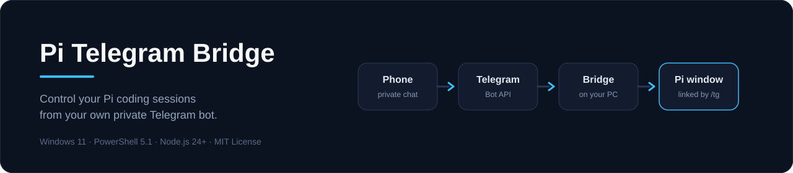
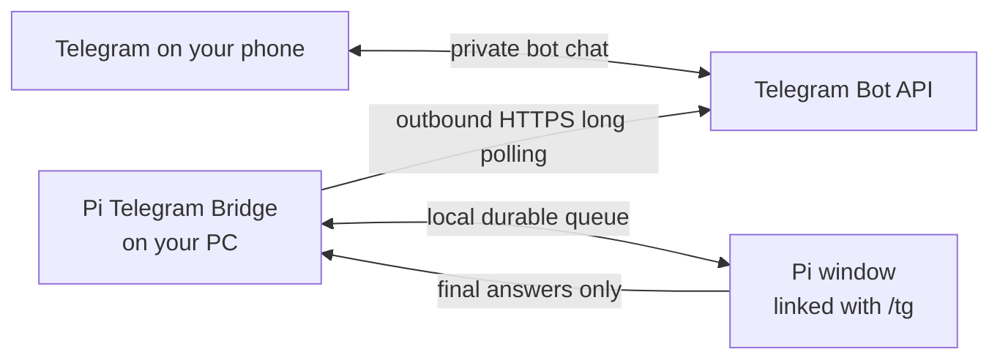

# Pi Telegram Bridge — control Pi from your phone

## HOW TO INSTALL

**Quick setup for Windows 11** (requires Node.js 24+, Pi installed on this PC, and Telegram on your phone):

1. Download the repository as a ZIP and extract it, or clone it with `git clone https://github.com/AgusLoza2021/pi-telegram-bridge.git`.
2. Create your own Telegram bot by messaging **@BotFather** with `/newbot`. Keep its token private.
3. Run **`Setup Pi Telegram.cmd`** from the extracted project folder and follow the prompts to enter your token and pair your phone with the QR code.
4. When you confirm with **ENROLL**, setup finishes on its own: it installs the helper and registers the background connection, but leaves it **OFF** — nothing starts by itself when you sign in. The helper is not placed where Pi loads things by itself either, so no Pi window has it unless you start that window with `pi-telegram.cmd` (Step 4). When you want the link, run `telegram on`; check it any time with `telegram status`, and use `telegram off` to stop it again.
5. When you are ready to use the link, open a Command Prompt in the setup folder, run `telegram on` there, then open Pi, run `/tg`, choose **Connect**, and message your bot in a private chat — open that Pi with **`pi-telegram.cmd`** from the same folder, because Pi never loads the bridge on its own.

The bridge intentionally ignores group chats. For prerequisites, screenshots, and troubleshooting, see the [complete beginner guide](#check-your-pc-first).



Talk to a Pi coding session on your Windows PC from your own private Telegram bot: send a normal message from your phone and receive Pi's finalized answer in the same chat.

You control only Pi sessions that you explicitly link with `/tg`. This is **not** remote CMD, PowerShell, or shell access to your PC.

**Never used anything like this before? Read this file from top to bottom and follow the steps in order. It takes about 10 minutes, and every step tells you what to type and what you should see.**


```mermaid
flowchart LR
    Phone["Telegram on your phone"] <-->|"private bot chat"| Telegram["Telegram Bot API"]
    Bridge["Pi Telegram Bridge<br/>on your PC"] -->|"outbound HTTPS long polling"| Telegram
    Bridge <-->|"local durable queue"| Pi["Pi window<br/>linked with /tg"]
    Pi -->|"final answers only"| Bridge
```

## What this is, in plain words

- **Pi** is an AI coding agent that runs in a terminal window on your PC. You type what you want, and Pi writes and changes code in your project folder.
- **This bridge** is a small relay that lives on your own PC. It connects your private Telegram bot chat to Pi. Nothing is hosted anywhere else — if your PC is off or asleep, the bridge is off too.
- **What reaches your phone** is only Pi's finalized answers — never your files, never your shell, never Pi's hidden reasoning. Your phone talks *to Pi*; it does not touch the rest of your PC.
- **What it is NOT:** it is not a way to run commands on your PC from your phone. There is no remote CMD or PowerShell access, and there is no listening port on your PC.

## Check your PC first (2 minutes)

Open this table and check each row before you start. Each check takes seconds, and finding a problem now saves you a failed setup later.

| What you need | How to check it | Where to get it |
|---|---|---|
| Windows 11 with PowerShell 5.1 or later | You are most likely fine. Windows 11 includes PowerShell 5.1 already. | Already included in Windows 11. |
| Node.js **24 or newer** | Press the Windows key, type `cmd`, press Enter to open the Command Prompt, type `node --version` and press Enter. | [https://nodejs.org](https://nodejs.org) — download the LTS installer and run it. |
| Pi installed and working on this same PC | Open Pi in a terminal and use it normally at least once. | Your existing Pi installation. |
| Telegram signed in on your phone | Open Telegram on your phone and confirm you are signed in. | [https://telegram.org](https://telegram.org) or your phone's app store. |

One more requirement that you cannot download: **your PC has to stay awake and online while you use the bridge.** Nothing runs in the cloud. If the PC sleeps or goes offline, the bot cannot answer until the PC is available again.

The Node.js check is the one that usually fails. Two things you might see after typing `node --version`:

- **`'node' is not recognized`** — Node.js is not installed (or Windows cannot find it yet). Install the current Node.js from [https://nodejs.org](https://nodejs.org), then **close the Command Prompt and open a new one** so Windows finds the freshly installed program, and try `node --version` again.
- **A version starting with `v18.` or `v22.`** — Node.js is installed but too old for this bridge. Install the current version from [https://nodejs.org](https://nodejs.org) and check again.

One reassurance: the setup on this PC now **refuses an unsupported Node.js before it asks you for anything** — before your bot token, before your phone, before it changes any setting. So if your Node.js is old, you will find out immediately in plain words, and nothing on your PC will have been touched. Checking first still saves you the wasted attempt.

## Step 1 — get the files onto your PC

You need the **whole folder** of this project on your PC — not just this README file. The setup uses several files in the folder together.

Pick one of these two routes:

- **You received a ZIP file.** Right-click the ZIP file and choose **Extract All...**. Choose a simple, short location such as `C:\pi-telegram-bridge`, and finish the extraction. Do not run the tool from inside the ZIP window — always from the extracted folder.
- **You use git.** Run `git clone https://github.com/AgusLoza2021/pi-telegram-bridge.git` in a terminal.

Two places to avoid:

- **Do not** put the folder inside OneDrive or any other synced folder (for example `C:\Users\you\OneDrive\...`). Sync software can interfere with the bridge's local files.
- **Do not** put the folder inside `C:\Program Files` or `C:\Program Files (x86)`. Windows protects those folders in ways that get in the setup's way.

A simple path like `C:\pi-telegram-bridge` works well.

## Step 2 — create your Telegram bot

You will create your own private bot in Telegram. This takes about 2 minutes.

1. Open Telegram on your phone and search for the official, verified **@BotFather** account (it has a verified checkmark).
2. Send it the message `/newbot`. It asks two questions: choose a display name, then choose a username that ends in `bot`.
3. BotFather replies with a **token** — a long line of letters, numbers, and colons. Copy it somewhere private on your PC. **Treat it like a password:** anyone who has it can use your bot. Never put it in issues, chats, logs, or screenshots.
4. Recommended: in BotFather, open your bot's settings and turn **Allow Groups** off. This keeps your bot private to you.

## Step 3 — run the setup

1. Open the folder you extracted in Step 1 (for example `C:\pi-telegram-bridge`).
2. Double-click **`Setup Pi Telegram.cmd`**. A black window opens — this is normal.
3. The window prepares a few local files. If a small helper package is missing, it downloads one small package from the internet. This usually takes a minute or two.
4. When it asks, **paste the bot token from Step 2**. The window hides what you paste. The token stays on your PC: it is stored in encrypted form (protected for your Windows account) and is never typed, sent, or shown anywhere else — not on your phone, not in any chat, not in any log.
5. The window shows a **QR code**. Open the camera app on your phone and point it at the code. Telegram opens your bot; tap **Start**. The code contains only the bot's name and a one-use pairing code — never the token.
6. The window waits up to a minute for your phone. When your phone is recognized, it asks you to type **ENROLL** to confirm. Nothing is saved until you do.
7. After you confirm, the window installs a small helper for Pi (it is kept outside the folders Pi loads by itself, so only windows you open with `pi-telegram.cmd` get it — see Step 4 — and it still stays inactive until *you* link that window) and registers the background task, but leaves the connection **OFF**: nothing starts by itself when you sign in. When you want it, open a Command Prompt in this folder and run `telegram on`. Use `telegram off` to stop it and `telegram status` to check it. You can also double-click `telegram.cmd` in File Explorer: it opens a small menu that shows the current connection state and lets you turn it on or off (typing `telegram on|off|status` in a terminal keeps working exactly the same). Once you turn it off, it stays off even after you restart Windows; start it again with `telegram on`.

If anything fails along the way, your previous settings are kept safe and nothing half-finished is saved. See [Fix problems](#fix-problems).

## Step 4 — link Pi and talk

The bridge is installed, but every Pi window stays **disconnected until you link it** — this is deliberate.

Pi never loads the bridge by itself. The bridge appears only in windows you start through **`pi-telegram.cmd`**: double-click that file, or open a Command Prompt in the setup folder and type `pi-telegram`. A Pi window started any other way has no `/tg` at all.

1. Start Pi with **`pi-telegram.cmd`**. It opens Pi in the folder you run it from, so run it from the project you want to work in. If a Pi window was already open during setup or an upgrade, close it completely and open it again this way so it loads the bridge — `/reload` alone is not enough.
2. Type `/tg` and choose **Connect** in the confirmation that appears.
3. Send a normal text message to your bot from your phone.

Pi's finalized answer arrives in the same chat.

## How do I know it worked?

Four things to look for, in order:

1. The setup window ended with the words **`Setup complete.`**
2. After you typed `/tg` and chose Connect, Pi replied with a message starting **"Linked. Send a message from your phone..."**
3. A normal message you typed on your phone reached that Pi as a prompt.
4. Pi's finalized answer came back to the same Telegram chat.

Any three of the four means you are almost there — check [Fix problems](#fix-problems) for the missing one.

## Everyday use

| On your phone | What happens |
|---|---|
| Send normal text | It becomes a prompt for the selected linked Pi. |
| Tap **Status** | The bot reports the selected Pi's connection state and model. |
| Tap **Projects** | Opens the Projects dashboard, where you pick which Pi gets your messages (see below). Typing `/projects` shows the same screen — the button is the beginner path. |
| Tap **Disconnect** | Disconnect the selected Pi from Telegram. |
| Send `/alias <name>` | Gives the selected Pi window a readable name, like `Home PC`. `/alias clear` resets it. |
| Send text while Pi is busy | Choose whether to add it for later, redirect the current task, stop and use it, or leave the task alone. |
| Pi asks a question | When Pi needs an ordinary decision mid-task, the bot shows the question with one button per option plus **Cancel this question**. Tap an option and the exact linked Pi continues with your choice — see [When Pi asks you a question](#when-pi-asks-you-a-question). |

### The Projects dashboard (your project library)

Tap **Projects** and the bot answers with one compact screen — the easy way to switch between Pi windows:

1. Look at the **Active now** rows: one row per Pi window you linked with `/tg` that is still running.
2. Tap the row you want. From then on, your messages go to that Pi. If a message of yours is saved and waiting to be delivered, tapping an active row sends it there instead.
3. Below them, **Recent** lists projects seen in the last 30 days (at most 20, newest first) that have no window running right now. These rows cannot be tapped — nothing is ever sent to an offline project.

How to read a row:

| What you see | What it means |
|---|---|
| `✓` in front of a row (highlighted blue) | This is the Pi your messages currently go to. |
| Colored square (🟦 🟪 🟧 🟩 🟨 🟫 ⬛ ⬜) | A stable color for that project folder — the same project keeps the same color. `⬜` can simply be that folder's color (the palette has eight slots, and `⬜` is one of them) or the neutral fallback when no color could be derived; either way it is orientation, not an error badge. |
| 🟢 **Available** | That Pi is running and idle. |
| 🟡 **Working** or 🟡 **Waiting** | That Pi is running but in the middle of a task. |
| ⚪ **Offline** | A Recent row: seen lately, not running now. |
| Name and `(branch)` | Your `/alias` name for that window, or the project folder name — plus its git branch when there is one and it fits. |
| **Refresh** | Reloads the screen. |

Three things worth knowing:

- Tapping an **Active now** row is what routes your messages: from that tap on, they go to that Pi. If a message of yours is saved and waiting to be delivered, tapping an active row sends it there instead.
- Your choice survives the bridge restarting on your PC, but only if the exact same Pi window and project are still running when it comes back. A closed or stale window is never sent anything — the bot asks you to pick again.
- Color is never the only signal: every row also carries the state circle and the state word in text. Every final Pi answer names the window that produced it, and the bot's confirmations name that window whenever the bridge still knows which Pi they are about; screens that are not about one particular window — global panels and generic confirmations — may arrive without a window name.

On the PC:

- `/tg` opens the connection controls for that Pi window.
- `/tg off` disconnects that Pi window.
- Only windows you started with `pi-telegram.cmd` have `/tg`: the bridge is never registered in Pi's automatic loading list.
- Every window you open with `pi-telegram.cmd` starts disconnected. Link only the windows you want available from your phone.
- After an install or upgrade, fully close and reopen any Pi windows that were already running; `/reload` alone is not sufficient because the helper has several runtime modules.
- To send a picture **from your PC to your phone**, see [Send a picture to your phone](#send-a-picture-to-your-phone).

### When Pi asks you a question

While it works, Pi sometimes needs a small decision from you — for example which of two fixes to apply. You can answer from your phone:

1. Pi asks an ordinary question with 2–4 options.
2. Telegram shows the question as a card with one button per option, plus **Cancel this question**.
3. Tap an option and the exact linked Pi continues with your choice. Tap **Cancel this question** and nothing is chosen.

The rules that keep this predictable:

- One question at a time per Pi window, and each question expires after 30 minutes. Nothing arrives on Telegram when a question expires — the tool simply times out on the PC. Only if you tap an out-of-date card does the bot answer with the fixed out-of-date toast; Pi asks again if it still needs an answer.
- Typing text while a question is pending is **not** an answer — the buttons on the card are the only way to answer it.
- This is for ordinary workflow choices of the current task. Permissions, approvals, security prompts and everything else Pi shows on the PC screen never become Telegram buttons.
- If the question never appears after an upgrade, fully close and reopen Pi — with `pi-telegram.cmd`, so that window has the bridge — and then run `/tg` again. The same rule as any other upgrade, under [the Projects section](#the-projects-dashboard-your-project-library).

## Send a picture to your phone

You can send one image from your PC to your own private chat, without opening Telegram on the PC:

```
node scripts/send-photo.mjs "C:\pi-telegram-bridge\screenshot.png"
```

Run it from the project folder — the same folder that holds `Setup Pi Telegram.cmd`. The final line it prints is `SENT`, and the picture shows up in your chat. You cannot choose the destination: a real send always goes to the private chat you paired during setup, because the chat id is never accepted from the command line.

These checks run **before** anything is uploaded, and a file that fails any of them is never sent:

| Rule | Value |
|---|---|
| Allowed formats | `.png`, `.jpg`, `.jpeg`, `.webp` |
| Maximum size | 10 MB |
| Where the file may live | Inside the project folder by default. For a picture somewhere else, add `--root "C:\the\folder"`. |

Two extras:

- **`--caption "text"`** sends a caption with the picture. It is always plain text: no formatting is ever applied to it.
- **`--dry-run`** validates the file and builds the exact request that would be sent, but sends nothing and reveals no credentials.

Run `node scripts/send-photo.mjs --help` to see every option and the enforced limits.

Two limits worth knowing:

- This is a **PC-side command**. Nothing on your phone can pull a picture off your disk.
- Your token is never printed, logged, or typed on the command line, and a failure prints one short code instead of a traceback.

## Send a voice note from your phone (it becomes text)

Instead of typing, record a voice note in your private chat. The bridge transcribes it **on your PC, locally** — the audio never leaves your machine — and the text arrives to the linked Pi window exactly as if you had typed it. Forwarded audio files work the same way.

This needs a one-time setup that is **never done automatically** — the project does not download binaries on its own:

1. Download the whisper.cpp Windows binary zip from its GitHub releases (release `v1.9.2` is the last one that ships `whisper-bin-x64.zip`) and extract `whisper-cli.exe` together with its `.dll` files into `.local/tools/whisper/`.
2. Download the model `ggml-small.bin` (~466 MB) into `.local/tools/whisper/models/`.
3. Put `ffmpeg.exe` at `.local/tools/ffmpeg/ffmpeg.exe`, or point the config at an ffmpeg you already have (a full absolute path is required).

That folder layout is the default configuration; every value can be overridden in the `transcription` section of the config (paths, language, thread count, caps, and the technical vocabulary prompt that helps Spanish dictation survive English words like "retry" or "merge").

Hard limits that protect the poll loop:

| Rule | Value |
|---|---|
| Maximum audio size | 20 MB |
| Maximum duration | 5 minutes (measured from the converted audio, not from Telegram's claim) |
| Per-process timeout | 2 minutes; a hung process is killed, never waited on |
| Where transcription runs | Your CPU only. No cloud service is ever contacted. |

If the audio cannot be transcribed (tool missing, file too large, decoder failure), the bot answers with one short fixed message and the bridge keeps working — nothing gets stuck.

## Fix problems

Find your symptom, then follow the matching action. A failed setup never replaces an existing working link.

| Symptom | What to do |
|---|---|
| Setup says it needs a newer Node.js | You are on Node.js 18 or 22. Install the current Node.js from [https://nodejs.org](https://nodejs.org), close the setup window, and run `Setup Pi Telegram.cmd` again. Nothing was changed on your PC. |
| `'node' is not recognized` when you check the version | Node.js is not installed. Install it from [https://nodejs.org](https://nodejs.org), then close and reopen the Command Prompt so the new PATH is picked up. |
| You double-clicked the setup file from **inside the ZIP file** | Windows runs it from a temporary folder that has none of the other project files, and the setup can report a missing tool that you actually have. Close that window, extract the ZIP properly (right-click → **Extract All...**), then run `Setup Pi Telegram.cmd` from the extracted folder. |
| Your setup folder is inside OneDrive or `Program Files` | Move the extracted folder somewhere simple such as `C:\pi-telegram-bridge` and run setup again. |
| Setup could not prepare its local files | Check your internet connection, then run `Setup Pi Telegram.cmd` again. Advanced details are in `.local/logs/setup-dependencies.log`. |
| Setup says the token did not work | Get the current token from BotFather using `/token` or `/mybots`, then copy and paste it again. |
| The QR code expired or will not scan | Close setup and run `Setup Pi Telegram.cmd` again for a fresh code. Raise the screen brightness and move the phone closer. |
| The QR link opens a web page | Open Telegram directly, search for your bot username, tap **Start**, then run setup again. |
| `/tg` does not exist in Pi | That Pi window was not started with the bridge, or it is still running the previous version. **Fully close and reopen Pi, then run `/tg`** — open it with `pi-telegram.cmd` in your setup folder (double-click the file, or type `pi-telegram`), because Pi never loads the bridge on its own. After an install or upgrade `pi` needs a full restart: `/reload` alone is not sufficient. |
| `/tg` says the phone connection is unavailable | The background connection is off. Open a Command Prompt in your setup folder, run `telegram on`, then send your message again. |
| The bot says no Pi is connected | Open Pi on the PC with `pi-telegram.cmd`, type `/tg`, and choose **Connect**. |
| The bot does not answer | Make sure the PC is awake and online, then check the background connection: run `telegram status` in your setup folder, and `telegram on` if it is off. |
| Several Pi windows are linked | Tap **Projects** and tap the row you want — the row marked `✓` is the one that gets your messages. |
| You closed a Pi window and the bot says it "just closed or disconnected" | That window is gone, so nothing was sent to it. Tap **Projects** and pick another row (or reopen the window with `/tg` and tap **Refresh**). |
| You want to remove the bridge | Follow [Uninstall and rollback](docs/ADVANCED.md#uninstall-and-rollback). State and backups are preserved unless you remove them yourself. |
| Sending a picture printed `FAILED: ...` | Each code names exactly one cause. `path_escape`: the file is outside the project folder — this check runs first, so you get it even when the file is also missing or misnamed; add `--root "C:\the\folder"` if the picture lives elsewhere. `not_found` or `not_a_file`: nothing readable at that path. `bad_extension`: not a `.png`, `.jpg`, `.jpeg`, or `.webp`. `too_large`: over 10 MB. `bad_root`: the folder you passed to `--root` does not exist. |
| The bot answers "I couldn't transcribe that audio" | Check the three tool files exist: `.local/tools/whisper/whisper-cli.exe`, `.local/tools/whisper/models/ggml-small.bin`, and `.local/tools/ffmpeg/ffmpeg.exe`. Audio over 20 MB or longer than 5 minutes is refused by design. If you just installed the tools, no restart is needed — the next voice note picks them up. |
| The question card vanished, or a tap says it is out of date | The question expired after 30 minutes or was already answered. Tap **Cancel this question** if it is still shown; Pi asks again if it still needs an answer. |
| I typed a reply but Pi did not take it | Typing is not an answer while a question is pending — tap one of the option buttons on the card, or **Cancel this question**. |
| You want voice transcription off | Set `transcription.enabled` to `false` in your local config. Voice notes then behave as if the feature did not exist: they are silently consumed, and no tool runs. |

For service status, repair, manual setup, and the full command reference, see the [Advanced guide](docs/ADVANCED.md).

## Words you'll see (plain-language glossary)

| Word | What it means here |
|---|---|
| **Bot** | A Telegram account run by a program instead of a person. You create your own with @BotFather, and only you can talk to it. |
| **Token** | The secret password BotFather gives you for your bot. It stays encrypted on your PC and never appears in chats or logs. |
| **`/tg`** | The command you type inside a Pi window to link (or unlink, with `/tg off`) that window to your phone. |
| **Alias** | A readable name you give one Pi window from your phone with `/alias <name>`, like `Home PC`. It is useful mostly when several windows work in the same project. The name sticks to that exact window: it survives the bridge restarting and the window reconnecting, but if you close the window and open a new one, the new window starts with its default project label again. |
| **Pi window** | One running copy of Pi in a terminal. You can have several; each one is linked separately. |
| **Choice question** | An ordinary question Pi asks mid-task with 2–4 options. The bridge shows it on Telegram as one button per option plus **Cancel this question**; your tap answers the exact linked Pi. One question per window, 30-minute deadline. On the PC this is the `telegram_ask_user_choice` tool — it never turns permissions, approvals or security prompts into buttons. |
| **Session / workspace** | A session is one live Pi window the bridge knows about; the workspace is the project folder that window is working in. Its folder name becomes the readable label you see on your phone, like `Pi · my-project`. |
| **The background connection** | A small program that runs quietly on your PC and shuttles messages between Telegram and Pi, so Pi can answer even when that Pi window is doing something else. It is registered as a Windows scheduled task, but the beginner setup registers it DISABLED and leaves it off, and the advanced setup asks once at the end whether to turn it on, with No as the default: nothing starts at a sign-in unless you turn it on. After that you control it yourself: `telegram off` stops it, `telegram on` starts it again, and once you turned it off it stays off after a restart until you turn it on again. It talks to Telegram by long polling. |

## Is it safe?

The bridge is local and fail-closed by design:

- Every Telegram message and button press must match both the enrolled private user ID and private chat ID. Messages from anyone else are ignored.
- The PC makes outbound HTTPS long-poll requests to Telegram; the bridge opens no listening port.
- The plaintext bot token never appears in source, process arguments, environment variables, chat, or logs. Its only on-disk form is an encrypted blob (Windows DPAPI, protected for your Windows account) inside a user-only state directory.
- Each Pi process opts in locally with `/tg`.
- Remote input reaches Pi only through Pi's official prompt, steer, follow-up, abort, status, and disconnect APIs. There is no remote shell.
- Telegram receives finalized assistant answers and explicit status results — not hidden reasoning, token-by-token streams, or raw tool-call transcripts.
- The QR code contains no token, user ID, or chat ID.

Read the full threat model and disclosure policy in [SECURITY.md](SECURITY.md).

To revoke access immediately, use BotFather → `/mybots` → your bot → **API Token** → **Revoke current token**. Run setup again to enroll the replacement token.

## Learn more

- [Quickstart in Spanish / Guía rápida en español](QUICKSTART.es.md) — a short Spanish guide from zero to a working install
- [Advanced guide](docs/ADVANCED.md) — commands, service lifecycle, manual setup, rollback, and legacy mode
- [Architecture](docs/ARCHITECTURE.md) — trust boundaries, data flow, durable transport, and component map
- [Beginner UX contract](docs/BEGINNER_UX.md) — exact product behavior used by maintainers

## Contributing, security, and license

Released under the [MIT License](LICENSE).

- Report security issues through [SECURITY.md](SECURITY.md).
- Development setup and contribution rules are in [CONTRIBUTING.md](CONTRIBUTING.md).
- Community expectations and enforcement are in the [Code of conduct](CODE_OF_CONDUCT.md).
