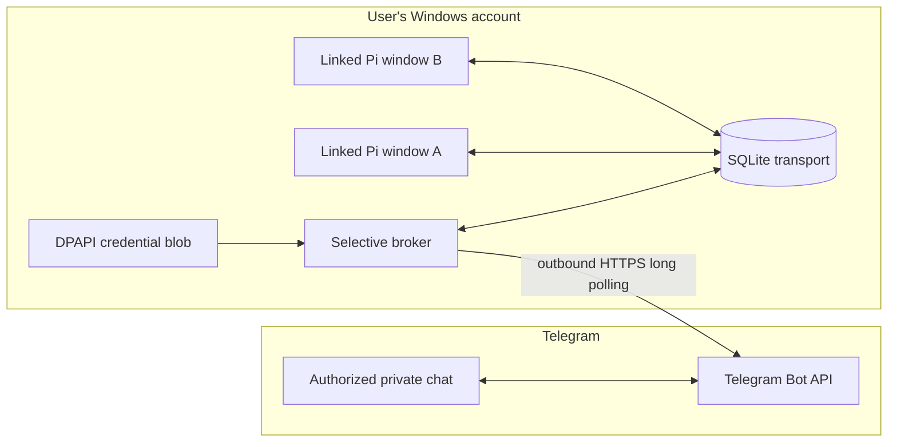

# Pi Telegram Bridge architecture

Pi Telegram Bridge connects an authorized private Telegram chat to Pi windows that opt in locally. The default selective broker is independent of Pi process ownership: it never starts Pi, never opens a shell endpoint, and never chooses an unlinked window.

## System boundary

No component listens on a public TCP port. Telegram cannot access the filesystem, execute CMD or PowerShell, or address a Pi process that has not registered itself through `/tg`.

## Trust boundaries

### Telegram boundary

Every message and callback must match both enrolled numeric values:

- the exact Telegram user ID;
- the exact private chat ID.

Unknown users, groups, chats, callback tokens, commands, session IDs, and stale selections fail closed. The QR pairing flow derives authorization only from the exact private-chat `/start <nonce>` update for a one-use 128-bit nonce.

### Credential boundary

The bot token is entered through a secure prompt and committed only after explicit enrollment confirmation. Windows DPAPI encrypts it for the current user, and the state root is protected and verified with a user-only ACL before the credential exists.

The plaintext token is never stored in source, SQLite, runtime JSON, process arguments, environment variables, or logs. The broker reveals it only inside the current-user process that performs Telegram API calls.

### Pi boundary

Each Pi process starts disconnected. The extension registers a transport client only after local opt-in through `/tg` or `/telegram-connect`.

Remote actions map to Pi's official extension APIs:

- prompt an idle session;
- steer a running turn;
- queue a follow-up;
- abort a turn;
- report status;
- disconnect the selected session.

There is no arbitrary command execution API. The broker does not spawn, own, signal, or terminate Pi processes.

### Git approval protocol

The single deliberate exception to "no mutating operations" is the closed, typed `/commit` and `/push` pair:

1. The owner sends `/commit` or `/push` in the enrolled private chat.
2. The extension takes a bounded read-only repository snapshot (branch, upstream, HEAD, staged index) and publishes a proposal event; the broker renders an exact approval card. The commit card shows the fixed automatic message `chore: update project files`; the push card shows the branch, upstream, HEAD and fingerprint summary.
3. The owner's **Approve** tap dispatches a one-use execute command carrying only the opaque proposal id — never a command string or argv.
4. The extension consumes the proposal, recomputes the snapshot, and refuses on any snapshot drift. Commit argv is fixed (`commit -m <fixed message>`, staged-only, hooks honored); push argv is the explicit upstream refspec with `--no-follow-tags`, `--atomic`, and never a force flag. A remote that does not support `--atomic` fails closed.
5. Every exit code is proven against the repository state before success is reported; results reach Telegram as whitelisted result codes with fixed, mapped copy only — raw Git diff output, stderr and diagnostics, full remote URLs, credentials, and local paths never do, and approval cards intentionally show only the bounded snapshot metadata (staged shortstat, branch, upstream alias, HEAD SHA, fingerprint, and the push card's ahead count). The success codes render operation-specific copy (`Commit approval ready`, `Push approval ready`, `Commit completed`, `Push completed`).
6. An uncertain outcome (timeout, kill, unproven mutation) is reported as `git_unknown` and must be resolved by manual repository inspection before any retry; it is never replayed automatically.

Local Git configuration, remote URLs, credential and transport helpers, and hooks remain fully trusted on the PC: an approval authorizes normal hook execution, which may run local programs or alter the resulting commit. This protocol is snapshot-bound and argv-fixed; it is not a sandbox for Git.

### Output boundary

The extension forwards only finalized assistant text and explicit command/status results. It does not forward chain-of-thought, model reasoning, token streams, tool calls, or tool results.

Large final answers are split into bounded Telegram chunks. The transport acknowledges an outbound event only after every chunk succeeds.

## Data flow

### Inbound prompt

1. The broker long-polls Telegram over outbound HTTPS.
2. It rejects updates that do not match the enrolled user and private chat.
3. It deduplicates accepted Telegram updates durably.
4. It resolves the selected live Pi session. Ambiguous or stale selections require an explicit choice.
5. It inserts one typed command into SQLite.
6. The intended Pi client claims that command exactly once and invokes the matching Pi API.
7. The command result is recorded for Telegram delivery.

### Busy Pi

When a normal message targets a busy Pi, the broker does not guess. It offers bounded choices to queue the message, steer the active turn, abort and replace it, or leave the task unchanged. The chosen callback is authorized and consumed once.

### Final answer

1. Pi completes its turn.
2. The extension records one bounded `final_output` event.
3. The broker sends all Telegram chunks.
4. The event is acknowledged only after complete delivery.

## Durable transport

`src/store.mjs` owns the SQLite schema and compare-and-swap operations for:

- TUI session registration, heartbeat, state, and disconnect;
- targeted typed commands and exactly-once claims;
- bounded outbound events and acknowledgements;
- Telegram update deduplication and polling offset;
- callback and selection state.

Liveness requires fresh session heartbeats and a live owning process. A stale or dead process is never advertised as connected.

The broker exposes nonsecret health through `broker-meta.json`: instance identity, process ID, start time, heartbeat, and graceful shutdown marker. `/tg` reports the phone connection as available only when this metadata matches the configured instance, the heartbeat is fresh, the process is live, and no shutdown is recorded. Local Pi linking remains durable so it can recover automatically after a broker restart.

## Component map

| Component | Primary files | Responsibility |
|---|---|---|
| Beginner launcher | `Setup Pi Telegram.cmd`, `scripts/setup.ps1` | Pinned dependency preparation, protected state root, enrollment, component installation, and broker start. |
| Enrollment | `src/enroll.mjs`, `src/qr-render.mjs` | Bot validation, webhook refusal, local QR rendering, one-use nonce pairing, explicit confirmation, and atomic DPAPI commit. |
| Runtime entrypoint | `src/runtime-broker.mjs` | Validate state identity, reveal credentials, run polling, emit heartbeat metadata, and honor graceful instance-bound stop requests. |
| Telegram router | `src/selective-telegram-broker.mjs` | Authorization, deduplication, session selection, beginner actions, advanced commands, and bounded delivery. |
| Durable store | `src/store.mjs` | SQLite schema, session leases, typed command claims, event acknowledgements, and transport invariants. |
| TUI client | `src/tui-bridge-client.mjs` | Credential-free Pi-side transport client, heartbeats, command claims, and bounded event writes. |
| Pi extension | `extension/selective-tui-extension.ts` | Local opt-in commands, official Pi API dispatch, state reporting, and finalized-text forwarding. |
| Extension installer | `scripts/install-selective-extension.ps1` and common helpers | Fixed-payload staging, hash verification, reparse protection, dated backup, and reversible installation. |
| Broker task lifecycle | `scripts/telegram.ps1` (the on/off/status switch) plus `scripts/*-broker-service.ps1` and common helpers | Current-user scheduled task registration (disabled by default), the on/off enable bit, persisted safety settings, status, start, graceful stop, backup, and uninstall. |
| Legacy runtime | `src/runtime-host.mjs`, `src/runtime-worker.mjs`, `src/telegram-worker.mjs` | Explicit fallback host/worker workflow; not used by the default selective broker. |

## Installed extension payload

The global Pi extension contains only four runtime files:

- `extension/selective-tui-extension.ts`
- `src/tui-bridge-client.mjs`
- `src/beginner-copy.mjs`
- `src/store.mjs`

A generated `index.ts` binds that installation to the selected local state directory. Installation verifies the payload hashes and rejects path, symlink, and junction escapes. It does not alter Pi's `settings.json` or unrelated extensions.

## Scheduled task model

`PiTelegramBridgeBroker` runs as the current interactive user with limited privileges. The registered settings are verified after installation:

- registered disabled initially: Beginner setup enables and starts it automatically after ENROLL, advanced setup asks before enabling, and afterwards the on/off switch owns the enable bit — once turned off with `telegram off`, a sign-in stays off until the owner runs `telegram on` again;
- logon trigger for the current user;
- no stop-on-idle or battery termination;
- unlimited execution duration;
- one active instance (`IgnoreNew`);
- start when available;
- bounded restart after unexpected failure.

Graceful shutdown uses an instance-bound local control file and bounded waits. Lifecycle scripts never force-kill an arbitrary process.

## Security invariants

1. Exact user and private-chat authorization on every Telegram update.
2. Outbound Telegram HTTPS only; no listening port.
3. DPAPI CurrentUser encryption inside a verified user-only state directory.
4. No secret in arguments, environment variables, logs, runtime JSON, or SQLite payloads.
5. Local per-process Pi opt-in; no automatic Pi connection.
6. Typed Pi operations only; no generic shell. The sole exception is the closed, snapshot-bound `/commit`/`/push` approval protocol (above) with fixed argv.
7. Finalized assistant output only; no reasoning or tool transcript transport.
8. Durable deduplication, command claims, and delivery acknowledgements.
9. Reversible installation with dated backups before replacement.
10. No mutation of unrelated Pi extensions or settings.

For operating procedures, see the [Advanced guide](ADVANCED.md). For vulnerability reporting and the full public security policy, see [SECURITY.md](../SECURITY.md).
